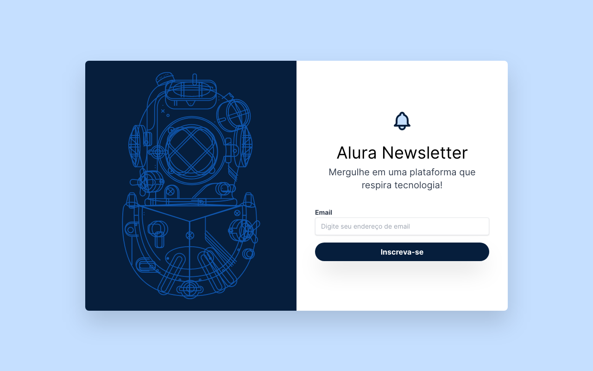

<h1 align="center">
  Alura Newsletter
</h1>

  

  <a href="#-tecnologias">Tecnologias</a>&nbsp;&nbsp;&nbsp;|&nbsp;&nbsp;&nbsp;
  <a href="#-projeto">Projeto</a>&nbsp;&nbsp;&nbsp;|&nbsp;&nbsp;&nbsp;

  

  

 

  

## 🚀 Tecnologias

Esse projeto foi desenvolvido com as seguintes tecnologias:

- HTML
- [Tailwind CSS](https://tailwindcss.com/)

## 🚧 Projeto:

Live Preview: https://newsletter-alura-umber.vercel.app/

---

Feito com ♥ by GabriellRossi
